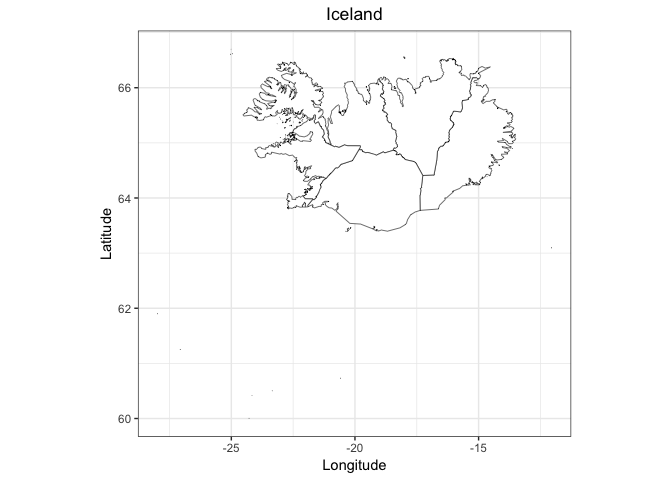
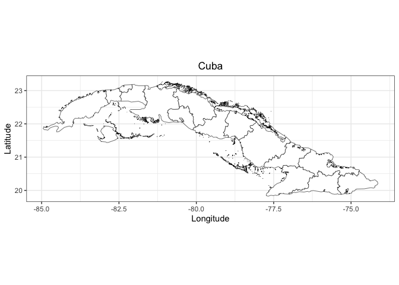
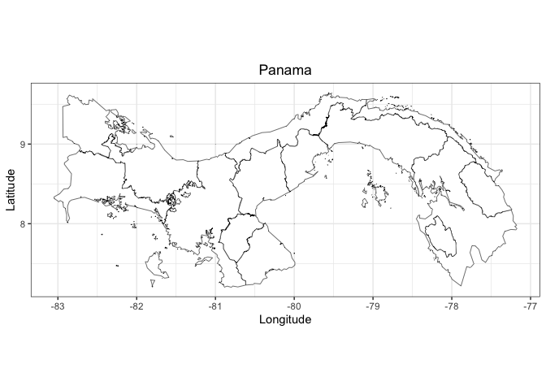

## Link
[https://github.com/lydiaPenglish/smoothMap](https://github.com/lydiaPenglish/smoothMap)

## Team Members
- Lydia English
- Yang Qiao
- Xiyuan Sun


## Description
The goal of `smoothMap` is to generate a function to help map files.

## Installation
You can install the released version of `smoothMap` from [Github](https://github.com/lydiaPenglish/smoothMap) with:
``` r
devtools::install_github("lydiaPenglish/smoothMap")
```

## Example
This is a basic example which shows you how to use the functions in `smoothMap`:


```r
library(smoothMap)
library(ggplot2)

isl_file <- system.file("extdata", "gadm36_ISL_1.shp", package = "smoothMap")
isl_data <- team_1(isl_file, tolerance = 0.01)
ggplot(isl_data, aes(x = long, y = lat, group = group)) +
  geom_polygon(color = "black", fill = "white", size = 0.2) +
  labs(x = "Longitude", y = "Latitude", title = "Iceland") +
  coord_quickmap() +
  theme_bw() +
  theme(plot.title = element_text(hjust = 0.5))
```



```r
cub_file <- system.file("extdata", "gadm36_CUB_1.shp", package = "smoothMap")
cub_data <- team_2(cub_file, tolerance = 0.01)
ggplot(cub_data, aes(x = long, y = lat, group = group)) +
  geom_polygon(color = "black", fill = "white", size = 0.2) +
  labs(x = "Longitude", y = "Latitude", title = "Cuba") +
  coord_quickmap() +
  theme_bw() +
  theme(plot.title = element_text(hjust = 0.5))
```



```r
pan_file <- system.file("extdata", "gadm36_PAN_1.shp", package = "smoothMap")
pan_data <- team_4(pan_file, tolerance = 0.01)
ggplot(pan_data, aes(x = long, y = lat, group = group)) +
  geom_polygon(color = "black", fill = "white", size = 0.2) +
  labs(x = "Longitude", y = "Latitude", title = "Panama") +
  coord_quickmap() +
  theme_bw() +
  theme(plot.title = element_text(hjust = 0.5))
```


